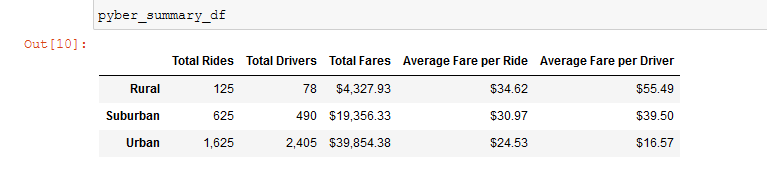
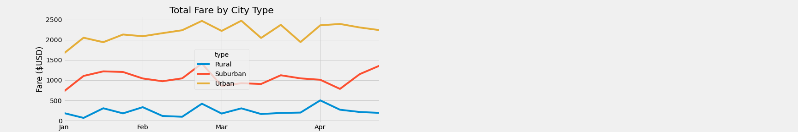

# Module 5 Challenge- _Deliverable 3_

This written analysis contains three sections:

**1. Overview of the analysis**

**2. Results**

**3. Summary**
 
## 1. Overview of the analysis

The aim of the analysis was to perfrom exploratory data analysis to provide actionable insights to help Pyber improve its access and determine affordability to under-served neighbourhoods.  V.Isaulize, CEO of Pyber, a ride sharing comapny valued at $2.3 billion, wants to review the rideshare data from January to May 2019 and is looking for key insights in order to make strategic decisions moving forward. Omar, who is my manager would help chart out the scope and partner in order to ensure the analysis lives up to V.Isualize's expectations.

Vi.Isualize wants to review the summary by city type. The analysis involved looking at over **2,300** rideshare records at over **120** cities from January to May 2019. The analysis was done in Python using Pandas and MatPlotLib in Jupyter Notebook to visualize.

## 2. Results

The results primarily highlight the differences among city types within the below criteria,
### **a. Total rides:**

From the image below, it is evident that Rural cities have **drastically low number of rides** compared to Subrban and Urban counterparts. Between Jan-May 2019, Rural cities have **five times less** *(125 vs 625)* rides than its Suburban counterparts. Compared to Urban cities, Rural cities have **thirteen times less** *(125 vs 1,625)* rides. 

Thus, Pyber has oppurtunities to increase accessibility at Rural cities. 

*a. Pyber Summary*

### **b. Total drivers:**

The summary above clearly shows that Rural cities were services by **significantly less drivers** compared to its Suburban and Urban counterparts. The number of drivers servicing Rural cities were almost **seven times less** *(78 vs 490)* than Suburban cities and over **thirty times less** *(78 vs 2,405)* compared to Urban cities.

Thus, it is evident that Pyber would want to increase the number of drivers that services Rural cities in order to increase accessibility,

### **c. Total fares:**

Looking at the Summary table (a) above, the Total fares validate an expected trend when we take the above two results into account. Urban cities, which has the primary share of the number of rides and drivers, accumulated the highest fare of **$39,854** which is double of Suburban cities and over nine times the Rural market.

Although largely along expected lines, this datapoint emphasizes the point that Urban cities remain the core of Pyber's business model. 
### **d. Average fare:**

#### *i) Average fare per ride:*

Reviewing the Average Fare per Ride, we see that Rural areas pay an average of *$34.62* per ride which is the **highest** and over 40% more than Urban cities *($34.62 vs $24.53)* which has the lowest fare per ride.  

This data-point suggests that Rural population pays more per ride compared to Suburban and Urban population. This is inspite of the fact that, as discussed above, Rural areas have lower accessibility. This suggests that if Pyber is able to expand its accessibility into Rural areas, it should be able to generate robust business returns going forward.

This data-point also shows the importance of having adequate drivers to increase affordability as is evident from Urban cities. We see that Urban areas are the most affordable while also having the highest number of rides and drivers.

#### *ii) Average fare per driver:*

Reviewing the Average Fare per Driver, we see that Rural areas pay an average of *$55.49* per driver which is the **highest** and over **340% more** than Urban cities *($55.49 vs $16.57)* which has the lowest fare per driver.  

This data-point suggests that drivers in the Rural population get more than three times per ride compared to Urban population and more than 40% more than their Suburban counterparts. This is inspite of the fact that, as discussed above, Rural population pays more per ride compared to other cities. This suggests that if Pyber is able to expand its number of drivers into Rural areas, it should be able to improve both accessibility and affordability going forward as the current pool of dRural Drivers might not be able to support all of the demand.

This data-point also suggests that Rural drivers potentially earn much more than their Urban and Suburban counterparts which should help Pyber with recruiting more drivers in Rural cities.
### e) Total fare by city type by Date

When we review the Total Fare for each city type over a period of time *(image below)* we observe very distinct levels of Fare generated each day across different city types. For eg. Rural total fares are consistently below $500, Suburban fares are in the $1,000 range while Urban fares are above $2,000. This suggests that the Total fares across city types are mostly consistent across the various days.

One observation with the Suburban cities is that in March we see the line dips until it rises steeply mid-April. This behavior is almost opposite to the trendline for Urban and Rural cities in the same timeframe which suggests that there might be some unique seasonality in the Suburban cities in the March which results in lower Fares.

Pyber needs to reasearch this phenomenon and understand the cause as this could open up oppurtunities to leverage the drivers in Suburban areas to perhaps service Rural areas. Once Suburban demand picks up in mid-April, Pyber could look at ways to recruit more drivers in Suburban areas to sustain the need.

*a. Total Fare by Month by City Types*

## 3. Summary

The three major proposals that could potentially address any disparities among city types for Pyber are as follows,

### a. Recruit more drivers and improve affordability and accessibility in Rural cities :

The results above clearly suggests that there is a lack of accessibility and affordability for the Rural population as they have the lowest number of drivers and pay the highest per trip compared to other categories. This suggests that Pyber isn't able to support the Rural population with enough drivers.

Thus Pyber should start recruitment of drivers to serve the Rural population.

### b. Improve accessibility to maximize potentially higher earning potential in Urban cities:

As the Total fares by city type indicates, Urban cities are Pyber's primary market segment accounting for over 60% of Pyber's total fares. However, despite having over **thirty times** more drivers than rural areas *(2405 vs 78)*, total Fares in Urban areas is only about **nine times** that of the Rural cities. This suggests that the drivers in Urban cities are not as effectively servicing the communities as Rural drivers. One of the reasons could be that most of the drivers are concentrated to service a specific time of the day or certain areas of the city. 

Pyber needs to investigate the cause of the lower returns from Urban drivers and put in strategies to maximize its accessibility and business potential in Urban areas while continuing to lead in terms of affordability.

### c. Focus on seasonality to maximize Total Fares in March and April timeframe in Suburban cities:

While reviewing the chart to highlight Total fares for each day between January and April 2019, it is evident there is oppurtunity for Pyber to be more flexible in how it employs its resources at various times of the year by city type. There is greater potential demand for Suburban cities from mid-April while Rural cities show an opposite trend. Pyber can look at ways to incentivize its Urban or Rural drivers to service more Suburban areas. Also, all three city types show a sharp rise in demand in late February. Pyber should look at ways to cater to this spike in demand by ensuring enough drivers are available during this time.

Pyber needs to investigate the causes of these seasonalities and explore ways to repurpose its pool of drivers and the fares they charge to improve both accesibility and affordability while reducing the gap between the city types.